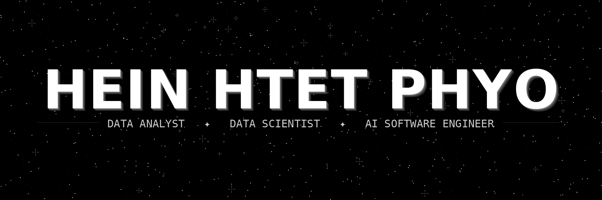

<div align="center">



<br/><br/>

🎓 &nbsp;**BSc Data Science & AI** &nbsp;·&nbsp; 🏆 &nbsp;**First Class Honours** &nbsp;·&nbsp; 🏛️ &nbsp;**UWE Bristol** &nbsp;·&nbsp; 📍 &nbsp;**London, UK** 🇬🇧 &nbsp;·&nbsp; 🟢 &nbsp;**Open to Graduate Roles**

<br/>

---

<br/>

### 👾 &nbsp; ABOUT ME

<br/>

Data Scientist & AI Software Engineer living at the intersection of **intelligence**, **data** & **craft**.
I build ML models, AI pipelines, supply chain optimisers & immersive 3D web experiences.
Code meant to be read · Systems meant to last.

<br/>

---

<br/>

### 🛰️ &nbsp; WHAT I'M BUILDING & WHERE I'M HEADING

<br/>

```
🤖  ML models that make real decisions    →   XGBoost · LightGBM · SARIMA
📊  data pipelines & analytics systems   →   Power BI · Plotly · GeoPandas · SQL
🌐  AI-powered 3D web experiences        →   Three.js · React Three Fiber · Next.js
⚙️  real-world system optimisation        →   Gurobi ILP · supply chain · forecasting
🧠  the frontier                          →   LLMs · AI agents · computer vision
```

<br/>

> 🎯 &nbsp;**Direction →** &nbsp; **Data Analysis · Data Science · AI Engineering** — owning the full pipeline from raw data to deployed model to real-world impact. Finance · logistics · urban intelligence · unsolved problems.

<br/>

---

<br/>

### 🛠️ &nbsp; SKILLS

<br/>

**🤖 &nbsp; ML / AI**

<br/>


<br/>

**📊 &nbsp; DATA ANALYTICS**

<br/>


<br/>

**🌐 &nbsp; FRONTEND / 3D**

<br/>


<br/>

**⚙️ &nbsp; DEVOPS**

<br/>


<br/>

---

<br/>

### 🔗 &nbsp; FIND ME ACROSS THE UNIVERSE

<br/>

[](https://heinhtetphyo.com)
&nbsp;&nbsp;
[](https://linkedin.com/in/hein-htet-phyo)
&nbsp;&nbsp;
[](mailto:heinhtetphyo56@gmail.com)
&nbsp;&nbsp;
[](https://github.com/HeinHtet-Phyo)

<br/><br/>


</div>
